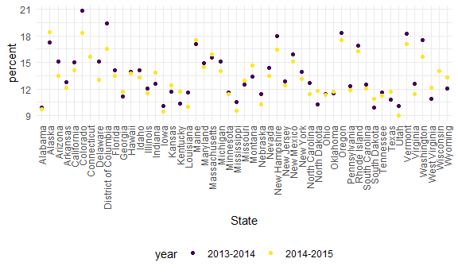
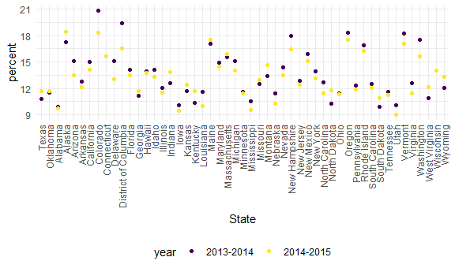
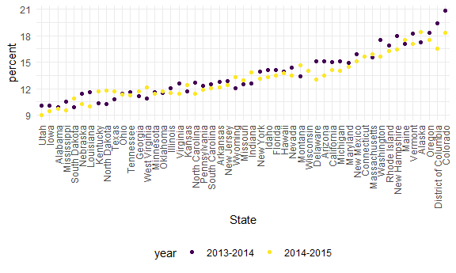
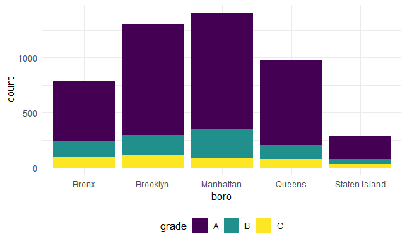
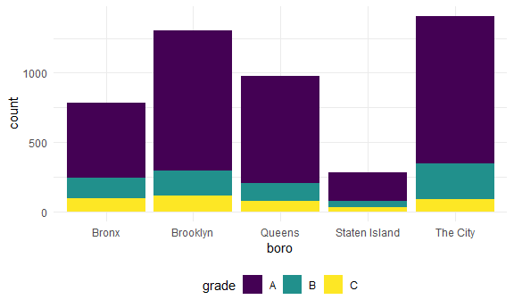
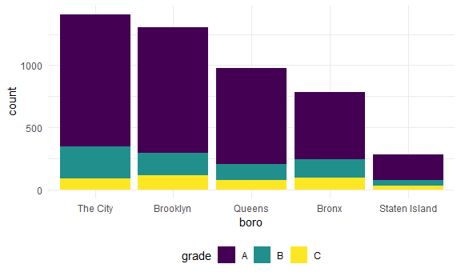
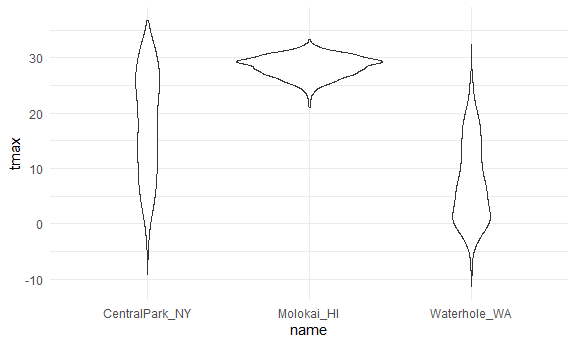
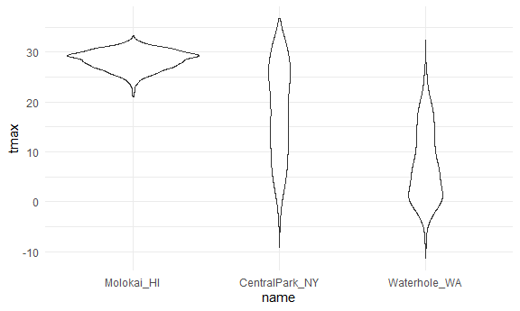
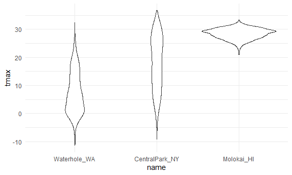

Strings and factors
================
2024-09-09

## Strings and regex

``` r
string_vec = c("my", "name", "is", "jeff")

str_detect(string_vec, "j")
```

    ## [1] FALSE FALSE FALSE  TRUE

``` r
str_detect(string_vec, "e")
```

    ## [1] FALSE  TRUE FALSE  TRUE

``` r
str_detect(string_vec, "Jeff")
```

    ## [1] FALSE FALSE FALSE FALSE

``` r
str_replace(string_vec, "jeff", "Jeff")
```

    ## [1] "my"   "name" "is"   "Jeff"

``` r
string_vec = c(
  "i think we all rule for participating",
  "i think i have been caught",
  "i think this will be quite fun actually",
  "it will be fun, i think"
  )

str_detect(string_vec, "i think")
```

    ## [1] TRUE TRUE TRUE TRUE

``` r
str_detect(string_vec, "^i think")
```

    ## [1]  TRUE  TRUE  TRUE FALSE

``` r
str_detect(string_vec, "i think$")
```

    ## [1] FALSE FALSE FALSE  TRUE

``` r
string_vec = c(
  "Time for a Pumpkin Spice Latte!",
  "went to the #pumpkinpatch last weekend",
  "Pumpkin Pie is obviously the best pie",
  "SMASHING PUMPKINS -- LIVE IN CONCERT!!"
  )

str_detect(string_vec, "pumpkin")
```

    ## [1] FALSE  TRUE FALSE FALSE

``` r
str_detect(string_vec, "Pumpkin")
```

    ## [1]  TRUE FALSE  TRUE FALSE

``` r
str_detect(string_vec, "[Pp]umpkin")
```

    ## [1]  TRUE  TRUE  TRUE FALSE

``` r
string_vec = c(
  '7th inning stretch',
  '1st half soon to begin. Texas won the toss.',
  'she is 5 feet 4 inches tall',
  '3AM - cant sleep :('
  )

str_detect(string_vec, "[0-9][a-zA-Z]")
```

    ## [1]  TRUE  TRUE FALSE  TRUE

``` r
string_vec = c(
  'Its 7:11 in the evening',
  'want to go to 7-11?',
  'my flight is AA711',
  'NetBios: scanning ip 203.167.114.66'
  )

str_detect(string_vec, "7.11") 
```

    ## [1]  TRUE  TRUE FALSE  TRUE

``` r
str_detect(string_vec, "7\\.11") 
```

    ## [1] FALSE FALSE FALSE  TRUE

``` r
string_vec = c(
  'The CI is [2, 5]',
  ':-]',
  ':-[',
  'I found the answer on pages [6-7]'
  )

str_detect(string_vec, "\\[")
```

    ## [1]  TRUE FALSE  TRUE  TRUE

## Factors

``` r
factor_vec = factor(c("male", "male", "female", "female"))

factor_vec
```

    ## [1] male   male   female female
    ## Levels: female male

``` r
as.numeric(factor_vec)
```

    ## [1] 2 2 1 1

Relevel

``` r
factor_vec = fct_relevel(factor_vec, "male")

factor_vec
```

    ## [1] male   male   female female
    ## Levels: male female

``` r
as.numeric(factor_vec)
```

    ## [1] 1 1 2 2

## NSDUH

``` r
url = "https://samhda.s3-us-gov-west-1.amazonaws.com/s3fs-public/field-uploads/2k15StateFiles/NSDUHsaeShortTermCHG2015.htm"

drug_use_html = read_html(url)
```

``` r
table_marj = 
  drug_use_html %>%
  html_table() %>%
  first() %>%
  slice(-1) %>% 
  as_tibble()

table_marj
```

    ## # A tibble: 56 × 16
    ##    State     `12+(2013-2014)` `12+(2014-2015)` `12+(P Value)` `12-17(2013-2014)`
    ##    <chr>     <chr>            <chr>            <chr>          <chr>             
    ##  1 Total U.… 12.90a           13.36            0.002          13.28b            
    ##  2 Northeast 13.88a           14.66            0.005          13.98             
    ##  3 Midwest   12.40b           12.76            0.082          12.45             
    ##  4 South     11.24a           11.64            0.029          12.02             
    ##  5 West      15.27            15.62            0.262          15.53a            
    ##  6 Alabama   9.98             9.60             0.426          9.90              
    ##  7 Alaska    19.60a           21.92            0.010          17.30             
    ##  8 Arizona   13.69            13.12            0.364          15.12             
    ##  9 Arkansas  11.37            11.59            0.678          12.79             
    ## 10 Californ… 14.49            15.25            0.103          15.03             
    ## # ℹ 46 more rows
    ## # ℹ 11 more variables: `12-17(2014-2015)` <chr>, `12-17(P Value)` <chr>,
    ## #   `18-25(2013-2014)` <chr>, `18-25(2014-2015)` <chr>, `18-25(P Value)` <chr>,
    ## #   `26+(2013-2014)` <chr>, `26+(2014-2015)` <chr>, `26+(P Value)` <chr>,
    ## #   `18+(2013-2014)` <chr>, `18+(2014-2015)` <chr>, `18+(P Value)` <chr>

``` r
data_marj =
  table_marj %>% 
  select(-contains("P value")) %>% 
  pivot_longer(
    -State,
    names_to = "age_year",
    values_to = "percent"
  ) %>% 
  separate(age_year, into = c("age", "year"), sep = "\\(") %>% 
  mutate(
    year = str_replace(year, "\\)", ""),
    percent = str_replace(percent, "[a-c]$", ""),
    percent = as.numeric(percent)
  ) %>% 
  filter(!(State %in% c("Total U.S.", "Northeast", "Midwest", "South", "West")))

data_marj
```

    ## # A tibble: 510 × 4
    ##    State   age   year      percent
    ##    <chr>   <chr> <chr>       <dbl>
    ##  1 Alabama 12+   2013-2014    9.98
    ##  2 Alabama 12+   2014-2015    9.6 
    ##  3 Alabama 12-17 2013-2014    9.9 
    ##  4 Alabama 12-17 2014-2015    9.71
    ##  5 Alabama 18-25 2013-2014   27.0 
    ##  6 Alabama 18-25 2014-2015   26.1 
    ##  7 Alabama 26+   2013-2014    7.1 
    ##  8 Alabama 26+   2014-2015    6.81
    ##  9 Alabama 18+   2013-2014    9.99
    ## 10 Alabama 18+   2014-2015    9.59
    ## # ℹ 500 more rows

## NSDUH – factors

``` r
data_marj %>% 
  filter(age == "12-17") %>%
  ggplot(aes(State, y = percent, color = year)) +
  geom_point() +
  theme(axis.text.x = element_text(angle = 90, vjust = 0.5, hjust = 1))
```



``` r
data_marj %>% 
  filter(age == "12-17") %>%
  mutate(State = fct_relevel(State, "Texas", "Oklahoma")) %>% 
  ggplot(aes(State, y = percent, color = year)) +
  geom_point() +
  theme(axis.text.x = element_text(angle = 90, vjust = 0.5, hjust = 1))
```



``` r
data_marj %>% 
  filter(age == "12-17") %>%
  mutate(State = fct_reorder(State, percent)) %>% 
  ggplot(aes(State, y = percent, color = year)) +
  geom_point() +
  theme(axis.text.x = element_text(angle = 90, vjust = 0.5, hjust = 1))
```



## Restaurant inspections

``` r
library(tidyverse)
library(httr)
library(jsonlite)
```

    ## 
    ## 载入程辑包：'jsonlite'

    ## The following object is masked from 'package:purrr':
    ## 
    ##     flatten

``` r
get_all_inspections = function(url) {
  
  all_inspections = vector("list", length = 0)
  
  loop_index = 1
  chunk_size = 50000
  DO_NEXT = TRUE
  
  while (DO_NEXT) {
    message("Getting data, page ", loop_index)
    
    all_inspections[[loop_index]] = 
      GET(url,
          query = list(`$order` = "zipcode",
                       `$limit` = chunk_size,
                       `$offset` = as.integer((loop_index - 1) * chunk_size)
                       )
          ) %>%
      content("text") %>%
      fromJSON() %>%
      as_tibble()
    
    DO_NEXT = dim(all_inspections[[loop_index]])[1] == chunk_size
    loop_index = loop_index + 1
  }
  
  all_inspections
  
}

url = "https://data.cityofnewyork.us/resource/43nn-pn8j.json"

rest_inspec = 
  get_all_inspections(url) %>%
  bind_rows() 
```

    ## Getting data, page 1

    ## Getting data, page 2

    ## Getting data, page 3

    ## Getting data, page 4

    ## Getting data, page 5

``` r
rest_inspec
```

    ## # A tibble: 246,929 × 26
    ##    camis    boro     building street zipcode phone inspection_date critical_flag
    ##    <chr>    <chr>    <chr>    <chr>  <chr>   <chr> <chr>           <chr>        
    ##  1 50126672 0        2        SHADY… 08512   6097… 1900-01-01T00:… Not Applicab…
    ##  2 50132187 Manhatt… NKA      CENTR… 10000   6469… 2024-07-23T00:… Not Critical 
    ##  3 50147715 Manhatt… 2        W 69T… 10000   3474… 2024-04-23T00:… Critical     
    ##  4 50132187 Manhatt… NKA      CENTR… 10000   6469… 2023-02-27T00:… Not Critical 
    ##  5 50147715 Manhatt… 2        W 69T… 10000   3474… 2024-04-23T00:… Critical     
    ##  6 50147715 Manhatt… 2        W 69T… 10000   3474… 2024-04-23T00:… Critical     
    ##  7 50132187 Manhatt… NKA      CENTR… 10000   6469… 2023-02-27T00:… Critical     
    ##  8 50132187 Manhatt… NKA      CENTR… 10000   6469… 2023-02-27T00:… Critical     
    ##  9 50132187 Manhatt… NKA      CENTR… 10000   6469… 2023-02-27T00:… Not Critical 
    ## 10 50147715 Manhatt… 2        W 69T… 10000   3474… 2024-04-23T00:… Not Critical 
    ## # ℹ 246,919 more rows
    ## # ℹ 18 more variables: record_date <chr>, dba <chr>, cuisine_description <chr>,
    ## #   action <chr>, violation_code <chr>, violation_description <chr>,
    ## #   score <chr>, grade <chr>, grade_date <chr>, inspection_type <chr>,
    ## #   latitude <chr>, longitude <chr>, community_board <chr>,
    ## #   council_district <chr>, census_tract <chr>, bin <chr>, bbl <chr>, nta <chr>

``` r
data("rest_inspec")
```

    ## Warning in data("rest_inspec"): 没有'rest_inspec'这个数据集

``` r
rest_inspec %>%
  group_by(boro, grade) %>% 
  summarize(n = n()) %>% 
  pivot_wider(names_from = grade, values_from = n)
```

    ## `summarise()` has grouped output by 'boro'. You can override using the
    ## `.groups` argument.

    ## # A tibble: 6 × 8
    ## # Groups:   boro [6]
    ##   boro           `NA`     A     B     C     N     P     Z
    ##   <chr>         <int> <int> <int> <int> <int> <int> <int>
    ## 1 0                21    NA    NA    NA    NA    NA    NA
    ## 2 Bronx         11418  7144  1463   734   743    71   593
    ## 3 Brooklyn      34730 21962  3543  2284  2209   210  1517
    ## 4 Manhattan     45952 31420  4646  2892  3560   216  2021
    ## 5 Queens        29847 18943  3491  2330  2382   177  1384
    ## 6 Staten Island  4259  3613   533   196   266    19   140

``` r
rest_inspec =
  rest_inspec %>% 
  filter(grade %in% c("A", "B", "C"), boro != "Missing") %>% 
  mutate(boro = str_to_title(boro))
```

``` r
rest_inspec %>% 
  filter(str_detect(dba, "Pizza")) %>% 
  group_by(boro, grade) %>% 
  summarize(n = n()) %>% 
  pivot_wider(names_from = grade, values_from = n)
```

    ## `summarise()` has grouped output by 'boro'. You can override using the
    ## `.groups` argument.

    ## # A tibble: 4 × 3
    ## # Groups:   boro [4]
    ##   boro          A     B
    ##   <chr>     <int> <int>
    ## 1 Bronx        10    NA
    ## 2 Brooklyn     18     2
    ## 3 Manhattan    31     5
    ## 4 Queens       11     5

``` r
rest_inspec %>% 
  filter(str_detect(dba, "[Pp][Ii][Zz][Zz][Aa]")) %>% 
  group_by(boro, grade) %>% 
  summarize(n = n()) %>% 
  pivot_wider(names_from = grade, values_from = n)
```

    ## `summarise()` has grouped output by 'boro'. You can override using the
    ## `.groups` argument.

    ## # A tibble: 5 × 4
    ## # Groups:   boro [5]
    ##   boro              A     B     C
    ##   <chr>         <int> <int> <int>
    ## 1 Bronx           541   153    93
    ## 2 Brooklyn       1014   177   116
    ## 3 Manhattan      1065   254    91
    ## 4 Queens          773   132    74
    ## 5 Staten Island   206    47    31

``` r
rest_inspec %>% 
  filter(str_detect(dba, "[Pp][Ii][Zz][Zz][Aa]")) %>% 
  ggplot(aes(x = boro, fill = grade)) +
  geom_bar()
```



``` r
rest_inspec %>% 
  filter(str_detect(dba, "[Pp][Ii][Zz][Zz][Aa]")) %>% 
  mutate(boro = fct_infreq(boro)) %>% 
  ggplot(aes(x = boro, fill = grade)) +
  geom_bar()
```


``` r
rest_inspec %>% 
  filter(str_detect(dba, "[Pp][Ii][Zz][Zz][Aa]")) %>% 
  mutate(
    boro = fct_infreq(boro),
    boro = str_replace(boro, "Manhattan", "The City")) %>% 
  ggplot(aes(x = boro, fill = grade)) +
  geom_bar()
```



``` r
rest_inspec %>% 
  filter(str_detect(dba, regex("pizza", ignore_case = TRUE))) %>% 
  mutate(
    boro = fct_infreq(boro),
    boro = fct_recode(boro, "The City" = "Manhattan")) %>% 
  ggplot(aes(x = boro, fill = grade)) +
  geom_bar()
```



## Weather

``` r
weather_df = 
  rnoaa::meteo_pull_monitors(
    c("USW00094728", "USW00022534", "USS0023B17S"),
    var = c("PRCP", "TMIN", "TMAX"), 
    date_min = "2021-01-01",
    date_max = "2023-12-31") |>
  mutate(
    name = recode(
      id, 
      USW00094728 = "CentralPark_NY", 
      USW00022534 = "Molokai_HI",
      USS0023B17S = "Waterhole_WA"),
    tmin = tmin / 10,
    tmax = tmax / 10) |>
  select(name, id, everything())
```

    ## Registered S3 method overwritten by 'hoardr':
    ##   method           from
    ##   print.cache_info httr

    ## using cached file: C:\Users\nrnhh\AppData\Local/R/cache/R/rnoaa/noaa_ghcnd/USW00094728.dly

    ## date created (size, mb): 2024-08-12 09:53:19.868105 (8.651)

    ## file min/max dates: 1869-01-01 / 2024-08-31

    ## using cached file: C:\Users\nrnhh\AppData\Local/R/cache/R/rnoaa/noaa_ghcnd/USW00022534.dly

    ## date created (size, mb): 2024-08-12 09:53:40.632154 (3.919)

    ## file min/max dates: 1949-10-01 / 2024-08-31

    ## using cached file: C:\Users\nrnhh\AppData\Local/R/cache/R/rnoaa/noaa_ghcnd/USS0023B17S.dly

    ## date created (size, mb): 2024-08-12 09:53:47.190077 (1.035)

    ## file min/max dates: 1999-09-01 / 2024-08-31

``` r
weather_df
```

    ## # A tibble: 3,285 × 6
    ##    name           id          date        prcp  tmax  tmin
    ##    <chr>          <chr>       <date>     <dbl> <dbl> <dbl>
    ##  1 CentralPark_NY USW00094728 2021-01-01   157   4.4   0.6
    ##  2 CentralPark_NY USW00094728 2021-01-02    13  10.6   2.2
    ##  3 CentralPark_NY USW00094728 2021-01-03    56   3.3   1.1
    ##  4 CentralPark_NY USW00094728 2021-01-04     5   6.1   1.7
    ##  5 CentralPark_NY USW00094728 2021-01-05     0   5.6   2.2
    ##  6 CentralPark_NY USW00094728 2021-01-06     0   5     1.1
    ##  7 CentralPark_NY USW00094728 2021-01-07     0   5    -1  
    ##  8 CentralPark_NY USW00094728 2021-01-08     0   2.8  -2.7
    ##  9 CentralPark_NY USW00094728 2021-01-09     0   2.8  -4.3
    ## 10 CentralPark_NY USW00094728 2021-01-10     0   5    -1.6
    ## # ℹ 3,275 more rows

``` r
weather_df %>% 
  ggplot(aes(x = name, y = tmax)) +
  geom_violin()
```

    ## Warning: Removed 19 rows containing non-finite values (`stat_ydensity()`).



``` r
weather_df %>% 
  mutate(name = fct_relevel(name, "Molokai_HI")) %>% 
  ggplot(aes(x = name, y = tmax)) +
  geom_violin()
```

    ## Warning: Removed 19 rows containing non-finite values (`stat_ydensity()`).



``` r
weather_df %>% 
  mutate(name = fct_reorder(name, tmax)) %>% 
  ggplot(aes(x = name, y = tmax)) +
  geom_violin()
```

    ## Warning: There was 1 warning in `mutate()`.
    ## ℹ In argument: `name = fct_reorder(name, tmax)`.
    ## Caused by warning:
    ## ! `fct_reorder()` removing 19 missing values.
    ## ℹ Use `.na_rm = TRUE` to silence this message.
    ## ℹ Use `.na_rm = FALSE` to preserve NAs.

    ## Warning: Removed 19 rows containing non-finite values (`stat_ydensity()`).



Linear regression

``` r
weather_df %>% 
  lm(tmax ~ name, data = .)
```

    ## 
    ## Call:
    ## lm(formula = tmax ~ name, data = .)
    ## 
    ## Coefficients:
    ##      (Intercept)    nameMolokai_HI  nameWaterhole_WA  
    ##            17.87             10.53            -10.31

Waterhole as the reference group, required to be in factor

``` r
weather_df %>% 
  mutate(name = fct_relevel(name, "Molokai_HI")) %>% 
  lm(tmax ~ name, data = .)
```

    ## 
    ## Call:
    ## lm(formula = tmax ~ name, data = .)
    ## 
    ## Coefficients:
    ##        (Intercept)  nameCentralPark_NY    nameWaterhole_WA  
    ##              28.40              -10.53              -20.84
